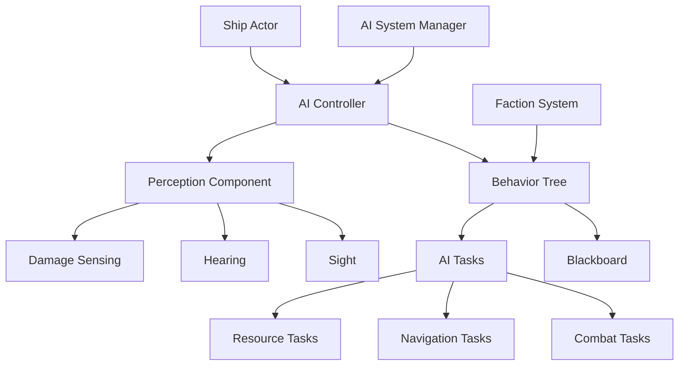

# AI System Setup Guide

> **🎯 Goal:** Configure and implement the AI system for NPCs and autonomous ships  
> **⏱️ Time Required:** 2-3 hours  
> **📚 Prerequisites:** [Complete Setup Guide](COMPLETE_SETUP_GUIDE.md) and [Ship System Setup](SHIP_SYSTEM_SETUP.md) completed

---

## 📋 Table of Contents

1. [Overview](#overview)
2. [Prerequisites](#prerequisites)
3. [AI System Architecture](#ai-system-architecture)
4. [Setting Up AI Components](#setting-up-ai-components)
5. [Creating AI Ships](#creating-ai-ships)
6. [Configuring AI Behavior](#configuring-ai-behavior)
7. [Testing AI](#testing-ai)
8. [Advanced Configuration](#advanced-configuration)
9. [Troubleshooting](#troubleshooting)

---

## 🎯 Overview

The SubspaceUE AI system provides intelligent behavior for NPCs, enemy ships, and allied vessels. This guide covers:

- ✅ AI component setup
- ✅ Behavior tree configuration
- ✅ AI ship spawning
- ✅ Combat AI tactics
- ✅ Mining and trading AI
- ✅ Faction-based behavior

### What You'll Build

By the end of this guide:
- 🤖 Functional AI system
- 🚀 AI-controlled ships
- ⚔️ Combat behaviors
- 💼 Trading and mining AI
- 🎭 Faction-based reactions

---

## 📦 Prerequisites

### Required Knowledge
- ✅ Basic Unreal Engine Blueprints
- ✅ Understanding of AI concepts
- ✅ Ship system basics

### Required Setup
- ✅ SubspaceUE project running
- ✅ Ship system configured
- ✅ At least one ship blueprint created

### Required Assets
- ✅ AI ship blueprints
- ✅ Behavior trees
- ✅ Blackboard assets

---

## 🏗️ AI System Architecture

### System Overview



### Key Components

#### 1. **AI Controller**
- Controls AI ship behavior
- Manages perception and decision-making
- Interfaces with behavior trees

#### 2. **Behavior Tree**
- Defines AI decision logic
- State-based behavior system
- Modular and extensible

#### 3. **Blackboard**
- AI memory system
- Stores targets, threats, resources
- Shared data between tasks

#### 4. **Perception Component**
- Environmental awareness
- Detects enemies, resources, stations
- Line of sight calculations

---

## 🛠️ Setting Up AI Components

### Step 1: Create AI Controller

1. **Create Blueprint**
   - Content Browser → `/Game/AI/`
   - Right-click → Blueprint Class
   - Parent Class: `AIController`
   - Name: `BP_ShipAIController`

2. **Configure AI Controller**

   In the AI Controller blueprint:

   **Add Components:**
   - Add `AIPerceptionComponent`
   - Add `AIPerceptionStimuliSource`

   **Configure Perception:**
   ```
   AI Perception Component:
     - Sight Config:
       - Sight Radius: 10000 cm
       - Lose Sight Radius: 12000 cm
       - Peripheral Vision Angle: 90 degrees
       - Detection by Affiliation: Detect Enemies, Neutrals
     
     - Damage Config:
       - Enabled: True
       - Report Damage to Self: True
```

3. **Set Up Event Graph**

   ```blueprint
   Event Begin Play
   ↓
   Run Behavior Tree
     - Behavior Tree: BT_ShipAI
   
   On Perception Updated
   ↓
   For Each Sensed Actor
   ↓
   If Successfully Sensed
     ├─ Is Enemy → Set as Target in Blackboard
     ├─ Is Resource → Set as Resource in Blackboard
     └─ Is Station → Set as Station in Blackboard
   ```

4. **Compile and Save**

### Step 2: Create Blackboard

1. **Create Asset**
   - Right-click in `/Game/AI/`
   - Artificial Intelligence → Blackboard
   - Name: `BB_ShipAI`

2. **Add Keys**

   Add these blackboard keys:

   ```
   Key Name          | Type           | Description
   ------------------|----------------|---------------------------
   SelfActor         | Object         | Reference to this AI ship
   TargetActor       | Object         | Current combat target
   TargetLocation    | Vector         | Target destination
   HomeLocation      | Vector         | Home base location
   PatrolLocation    | Vector         | Current patrol point
   HasTarget         | Bool           | Whether has valid target
   IsInCombat        | Bool           | Currently fighting
   HealthPercent     | Float          | Current health percentage
   NearestResource   | Object         | Nearest asteroid/resource
   NearestStation    | Object         | Nearest friendly station
   CurrentState      | Enum           | AI state (Idle, Combat, etc.)
   ThreatLevel       | Float          | Perceived threat level
   FactionID         | Int            | This ship's faction
   ```

3. **Save Blackboard**

### Step 3: Create Behavior Tree

1. **Create Asset**
   - Right-click in `/Game/AI/`
   - Artificial Intelligence → Behavior Tree
   - Name: `BT_ShipAI`

2. **Link Blackboard**
   - Open BT_ShipAI
   - Details Panel → Blackboard Asset: `BB_ShipAI`

3. **Build Behavior Tree**

   Create this structure:

   ```
   Root
   ↓
   Selector (Main Decision)
   ├─ Sequence (Emergency)
   │   ├─ Condition: Health < 20%
   │   └─ Task: Flee to Safety
   │
   ├─ Sequence (Combat)
   │   ├─ Condition: Has Target
   │   ├─ Task: Move to Combat Range
   │   └─ Task: Attack Target
   │
   ├─ Sequence (Mining)
   │   ├─ Condition: Has Resource Target
   │   ├─ Task: Move to Resource
   │   └─ Task: Mine Resource
   │
   ├─ Sequence (Trading)
   │   ├─ Condition: Has Station Target
   │   ├─ Task: Move to Station
   │   └─ Task: Trade at Station
   │
   └─ Sequence (Patrol)
       ├─ Task: Get Next Patrol Point
       ├─ Task: Move to Patrol Point
       └─ Wait 3-5 seconds
   ```

4. **Save Behavior Tree**

### Step 4: Create AI Tasks

Create custom tasks for AI actions:

#### Attack Task

1. **Create Task**
   - Right-click → Blueprint Class
   - Parent: `BTTask_BlueprintBase`
   - Name: `BTTask_AttackTarget`

2. **Implement Logic**

   ```blueprint
   Event Receive Execute AI
   ↓
   Get Blackboard → TargetActor
   ↓
   Get Controlled Pawn (AI Ship)
   ↓
   Calculate Distance to Target
   ↓
   If In Weapon Range:
     ├─ Rotate Toward Target
     ├─ Fire Weapons
     └─ Finish Execute (Success)
   Else:
     └─ Finish Execute (Failed)
   ```

#### Mining Task

1. **Create Task: `BTTask_MineResource`**

2. **Implement Logic**

   ```blueprint
   Event Receive Execute AI
   ↓
   Get Blackboard → NearestResource
   ↓
   Get Controlled Pawn (AI Ship)
   ↓
   If Has Mining Equipment:
     ├─ Activate Mining Laser
     ├─ Wait for Mining Complete
     ├─ Collect Resources
     └─ Finish Execute (Success)
   Else:
     └─ Finish Execute (Failed)
   ```

---

## 🚀 Creating AI Ships

### Step 1: Create AI Ship Blueprint

1. **Duplicate Ship Blueprint**
   - Find existing ship blueprint
   - Duplicate: `BP_Ship_Fighter` → `BP_AIShip_Fighter`

2. **Set AI Controller**
   - Open `BP_AIShip_Fighter`
   - Details → Pawn
   - AI Controller Class: `BP_ShipAIController`
   - Auto Possess AI: `Placed in World or Spawned`

3. **Add AI Components**

   Add these components:
   - `AIPerceptionStimuliSource` - Makes ship detectable
   - `FactionComponent` - Faction membership
   - `CombatComponent` - Combat capabilities

4. **Configure Combat**

   ```
   Combat Component:
     - Weapons: Add weapon modules
     - Fire Rate: 2.0 shots/sec
     - Weapon Range: 3000 cm
     - Can Target: Enemies
   ```

5. **Set Initial Values**

   In Construction Script or Defaults:
   ```
   Health: 500
   Max Speed: 1000 cm/s
   Faction ID: 1 (Enemy)
   AI Personality: Aggressive
   ```

### Step 2: Create AI Spawner

1. **Create Spawner Blueprint**
   - New Blueprint Actor: `BP_AIShipSpawner`
   - Name: `BP_AIShipSpawner`

2. **Add Variables**

   ```
   Ship Class to Spawn: BP_AIShip_Fighter
   Spawn Interval: 30 seconds
   Max Ships: 5
   Spawn Radius: 5000 cm
   Auto Spawn: True
   ```

3. **Implement Spawning Logic**

   ```blueprint
   Event Begin Play
   ↓
   If Auto Spawn:
     Set Timer by Event (Spawn Interval, Looping)
   
   Spawn Ship Event:
   ↓
   Count Active Ships
   ↓
   If Count < Max Ships:
     ├─ Get Random Point in Radius
     ├─ Spawn Actor (Ship Class)
     ├─ Set Spawn Transform
     └─ Initialize AI
   ```

4. **Place in Level**
   - Drag `BP_AIShipSpawner` into level
   - Position where you want ships to spawn
   - Configure spawn settings in Details panel

---

## ⚙️ Configuring AI Behavior

### AI Personalities

Create different AI personalities for variety:

**1. Aggressive**
```
Personality Settings:
  - Engage Range: 5000 cm (far)
  - Retreat Health: 10% (almost never)
  - Aggression: 1.0 (max)
  - Combat Style: Frontal Assault
```

**2. Defensive**
```
Personality Settings:
  - Engage Range: 2000 cm (close)
  - Retreat Health: 50% (cautious)
  - Aggression: 0.3 (low)
  - Combat Style: Kiting (stay at range)
```

**3. Miner**
```
Personality Settings:
  - Engage Range: 0 (don't attack)
  - Priority: Resource gathering
  - Retreat Health: 70%
  - Will Flee: Always
```

### Faction Configuration

1. **Create Faction Data Table**
   - Right-click → Miscellaneous → Data Table
   - Row Structure: `FactionData`
   - Name: `DT_Factions`

2. **Define Factions**

   ```
   Faction ID | Name      | Relations
   -----------|-----------|------------------
   0          | Player    | Hostile to 1,2
   1          | Pirates   | Hostile to 0,3
   2          | Raiders   | Hostile to all
   3          | Traders   | Friendly to 0
   ```

3. **Implement Faction Logic**

   In AI Controller:
   ```blueprint
   On Detect Actor
   ↓
   Get Both Actors' Factions
   ↓
   Look up Faction Relations
   ↓
   If Hostile:
     └─ Set as Enemy Target
   If Friendly:
     └─ Ignore or Assist
   ```

---

## ✅ Testing AI

### Test Checklist

- [ ] **AI Ship Spawns** - Spawner creates ships
- [ ] **AI Perception** - AI detects player and enemies
- [ ] **AI Movement** - Ships navigate properly
- [ ] **Combat Behavior** - Ships engage in combat
- [ ] **Retreat Behavior** - Damaged ships flee
- [ ] **Mining Behavior** - Miner ships gather resources
- [ ] **Faction Behavior** - Correct friend/foe recognition

### Test Scenarios

**Scenario 1: Combat Test**
1. Spawn enemy AI ship
2. Approach in player ship
3. Verify AI engages and attacks
4. Damage AI ship to low health
5. Verify AI retreats

**Scenario 2: Mining Test**
1. Spawn miner AI ship
2. Place asteroids in scene
3. Verify AI locates and mines asteroids
4. Verify AI returns to station when full

**Scenario 3: Faction Test**
1. Spawn ships from different factions
2. Verify hostile factions attack each other
3. Verify friendly factions ignore each other

### Debug Tools

Enable AI debugging:

**Console Commands:**
```
ShowDebug AI
ShowDebug Perception
ShowDebug Navigation
```

**Visual Debugging:**
- Green lines = Sight
- Red lines = Lost sight
- Blue spheres = Waypoints
- Yellow = Current target

---

## 🔧 Advanced Configuration

### Environmental Queries (EQS)

Use EQS for smart positioning:

1. **Create EQS Query**
   - Right-click → AI → Environment Query
   - Name: `EQS_FindCover`

2. **Configure Query**

   ```
   Generators:
     - Points around actor (target)
     - Circle radius: 2000 cm
     - Points: 20
   
   Tests:
     - Distance to target (prefer farther)
     - Line of sight to target (prefer blocked)
     - Distance to self (prefer closer to AI)
   ```

3. **Use in Behavior Tree**

   ```blueprint
   Task: Find Cover
   ↓
   Run EQS Query (EQS_FindCover)
   ↓
   Set Result as Target Location
   ```

### Formation Flying

Create squad-based AI:

1. **Squad Manager**
   - Tracks squad members
   - Assigns formation positions
   - Coordinates attacks

2. **Formation Positions**

   ```
   Leader Position: (0, 0, 0)
   Wingman 1: (-200, -200, 0)
   Wingman 2: (200, -200, 0)
   ```

3. **Formation Behavior**

   ```blueprint
   Update Formation
   ↓
   Get Leader Position
   ↓
   Calculate Own Formation Offset
   ↓
   Move to Formation Position
   ↓
   Match Leader Speed and Direction
   ```

---

## 🔧 Troubleshooting

### AI Not Spawning

**Solutions:**
- Check AI Controller is assigned
- Verify Auto Possess AI is set
- Check spawn location isn't blocked

### AI Not Detecting Player

**Solutions:**
- Verify Perception Component configured
- Check sight radius is large enough
- Ensure player has stimulus source
- Check Team ID/affiliation settings

### AI Not Attacking

**Solutions:**
- Verify Has Target in blackboard
- Check weapon components exist
- Verify faction relations are hostile
- Check combat range settings

### AI Ships Colliding

**Solutions:**
- Enable avoidance in movement component
- Increase separation radius
- Use formation flying
- Add collision avoidance behavior

---

## 📚 Related Documentation

- [AI System Guide](guides/AI_SYSTEM_GUIDE.md) - Complete AI documentation
- [Ship System Setup](SHIP_SYSTEM_SETUP.md) - Ship configuration
- [Combat System Setup](COMBAT_SYSTEM_SETUP.md) - Weapons and damage

---

**🤖 Your AI system is ready! Ships will now think for themselves! 🚀**

---

**Navigation:**  
[← Back: Space Scene Setup](SPACE_SCENE_SETUP.md) | [🏠 Home](README.md) | [Next: Combat System Setup →](COMBAT_SYSTEM_SETUP.md)
