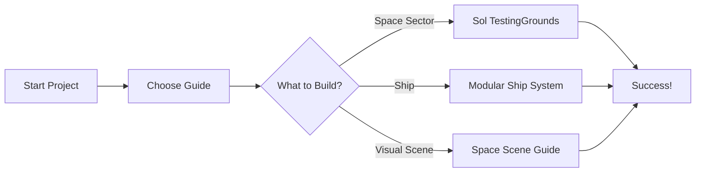

# SubspaceUE Documentation

<p align="center">
  
</p>

> **Advanced Space Game Engine** - Built with Unreal Engine 5.7  
> A cutting-edge game engine for space exploration and combat with modular ship construction

---

## 🌟 Welcome!

This comprehensive documentation will guide you through every aspect of SubspaceUE, from quick start to advanced implementation. Whether you're a **visual learner**, developer, or contributor, we've organized 118+ guides to help you succeed.

### 📚 Documentation Formats

This documentation is available in multiple formats for different learning styles:

- **🌐 Interactive Website** - You're here! Browse with search, navigation, and interactive diagrams
- **📄 PDF Downloads** - [Individual PDFs](#pdf-documentation) for offline reading
- **📦 Complete PDF Book** - [Download full documentation](#complete-documentation-pdf) as a single PDF
- **📝 Markdown Files** - Raw markdown files in the repository

---

## 🎯 Quick Navigation

<div style="display: grid; grid-template-columns: repeat(auto-fit, minmax(250px, 1fr)); gap: 20px; margin: 30px 0;">

### 🚀 Getting Started
Perfect for beginners and visual learners!

- [Quick Start Guide](QUICKSTART.md) - Get running in minutes
- [How to Build & Run](HOW_TO_BUILD_AND_RUN.md) - Detailed setup
- [Sol TestingGrounds Quick Start](SOL_QUICK_SETUP.md) - Your first space sector
- [Video Tutorials](#) - Coming soon!

### 🏗️ Architecture & Design
Understand the system structure

- [System Architecture](architecture/ARCHITECTURE.md) - Complete overview
- [Architecture Diagrams](architecture/ARCHITECTURE_DIAGRAM.md) - Visual system maps
- [AI Voxel System](architecture/AI_VOXEL_SYSTEM_ARCHITECTURE.md) - AI design

### 🎮 Gameplay & Features
Learn what you can build

- [Core Gameplay Mechanics](guides/CORE_GAMEPLAY_MECHANICS.md) - Game loop
- [All Gameplay Features](guides/GAMEPLAY_FEATURES.md) - Feature list
- [Galaxy Map Guide](guides/GALAXY_MAP_GUIDE.md) - Navigation system
- [Quest System](guides/QUEST_SYSTEM_GUIDE.md) - Mission system

### 🛠️ Ship Building
Create amazing spaceships

- [Modular Ship System](guides/MODULAR_SHIP_SYSTEM_GUIDE.md) - Main ship guide
- [Ship Interior Generation](SHIP_INTERIOR_GENERATION_GUIDE.md) - Interior design
- [Building Guide](guides/BUILDING_GUIDE.md) - Construction mechanics
- [Ulysses Model Import](ULYSSES_MODEL_IMPORT_GUIDE.md) - Asset import

### 🎨 Visuals & Graphics
Make it beautiful

- [Space Scene Generation](SPACE_SCENE_GENERATION_WITH_STORE_ASSETS.md) - Professional scenes
- [Camera & Visual Improvements](CAMERA_AND_VISUAL_IMPROVEMENTS.md) - Camera system
- [Skybox Material Guide](SKYBOX_MATERIAL_GUIDE.md) - Sky backgrounds
- [Texture Customization](guides/TEXTURE_CUSTOMIZATION_GUIDE.md) - Material system

### 🔧 Implementation
For developers

- [Implementation Status](implementation/IMPLEMENTATION_COMPLETE.md) - What's done
- [Implementation Roadmap](implementation/IMPLEMENTATION_ROADMAP.md) - What's next
- [UE5 Migration Checklist](migration/UE5_MIGRATION_CHECKLIST.md) - Migration guide
- [Development Status](reference/DEVELOPMENT_STATUS.md) - Current state

</div>

---

## 📖 Documentation Categories

### By Experience Level

#### 🌱 **Beginner** - New to SubspaceUE?
1. [Quick Start Guide](QUICKSTART.md) - Start here!
2. [Sol TestingGrounds Quick Start](SOL_QUICK_SETUP.md) - Build your first sector
3. [How to Build & Run](HOW_TO_BUILD_AND_RUN.md) - Setup instructions
4. [Automated Build Guide](AUTOMATED_BUILD_GUIDE.md) - Automate your builds
5. [Controls Guide](CONTROLS_GUIDE.md) - Learn the controls
6. [Testing Guide](TESTING_GUIDE.md) - Test your setup

#### 🎓 **Intermediate** - Ready to build?
1. [Core Gameplay Mechanics](guides/CORE_GAMEPLAY_MECHANICS.md)
2. [Modular Ship System](guides/MODULAR_SHIP_SYSTEM_GUIDE.md)
3. [Space Scene Generation](SPACE_SCENE_GENERATION_WITH_STORE_ASSETS.md)
4. [Galaxy Map Guide](guides/GALAXY_MAP_GUIDE.md)
5. [AI System Guide](guides/AI_SYSTEM_GUIDE.md)

#### 🚀 **Advanced** - Contribute to the engine?
1. [System Architecture](architecture/ARCHITECTURE.md)
2. [UE5 Migration Checklist](migration/UE5_MIGRATION_CHECKLIST.md)
3. [Implementation Roadmap](implementation/IMPLEMENTATION_ROADMAP.md)
4. [Contributing Guide](CONTRIBUTING.md)
5. [What's Left to Implement](reference/WHATS_LEFT_TO_IMPLEMENT.md)

### By Topic

#### 🎮 **Gameplay**
- Core mechanics, features, quests, AI behavior
- [View all gameplay guides →](guides/CORE_GAMEPLAY_MECHANICS.md)

#### 🛠️ **Ship Building**
- Modular systems, voxels, damage, interiors
- [View all ship guides →](guides/MODULAR_SHIP_SYSTEM_GUIDE.md)

#### 🎨 **Graphics & Visuals**
- Materials, skyboxes, scenes, camera
- [View all visual guides →](SPACE_SCENE_GENERATION_WITH_STORE_ASSETS.md)

#### 🏗️ **Architecture**
- System design, patterns, data flow
- [View architecture docs →](architecture/ARCHITECTURE.md)

#### 🔄 **UE5 Migration**
- C# to UE5 conversion, blueprints, migration status
- [View migration docs →](migration/UE5_MIGRATION_CHECKLIST.md)

---

## 🎨 For Visual Learners

We understand that different people learn in different ways. This documentation is enhanced for visual learners with:

### ✨ Visual Features

- **📊 Diagrams & Flowcharts** - Mermaid diagrams throughout the docs
- **🖼️ Screenshots** - Step-by-step visual guides with images
- **🎥 Videos** - Video tutorials (coming soon)
- **🗺️ Navigation Maps** - Easy-to-follow site navigation
- **🔍 Visual Search** - Find what you need quickly
- **📱 Responsive Design** - Works on any device
- **🌙 Dark/Light Mode** - Choose your preference (coming soon)

### 📊 Interactive Diagrams

Many guides include interactive Mermaid diagrams like this:



---

## 📄 PDF Documentation

### Individual Guide PDFs

Download individual guides as PDFs for offline reading:

#### Quick Start PDFs
- [Quick Start Guide (PDF)](pdfs/QUICKSTART.pdf)
- [Sol TestingGrounds Quick Start (PDF)](pdfs/SOL_QUICK_SETUP.pdf)
- [How to Build & Run (PDF)](pdfs/HOW_TO_BUILD_AND_RUN.pdf)

#### Core System PDFs
- [Modular Ship System Guide (PDF)](pdfs/MODULAR_SHIP_SYSTEM_GUIDE.pdf)
- [Space Scene Generation (PDF)](pdfs/SPACE_SCENE_GENERATION.pdf)
- [AI System Guide (PDF)](pdfs/AI_SYSTEM_GUIDE.pdf)
- [Architecture Overview (PDF)](pdfs/ARCHITECTURE.pdf)

#### Complete Guide PDFs
- [Sol TestingGrounds Implementation (PDF)](pdfs/SOL_TESTINGGROUNDS_IMPLEMENTATION.pdf)
- [Ship Interior Generation (PDF)](pdfs/SHIP_INTERIOR_GENERATION.pdf)
- [UE5 Migration Checklist (PDF)](pdfs/UE5_MIGRATION_CHECKLIST.pdf)

### Complete Documentation PDF

**📦 [Download Complete Documentation Book (PDF)](pdfs/SubspaceUE_Complete_Documentation.pdf)** - All guides in one comprehensive PDF (Coming soon)

---

## 🔍 How to Use This Documentation

### Search
Use the search box in the sidebar to find any topic instantly. Try searching for:
- "ship building"
- "UE5 migration"
- "space scene"
- "troubleshooting"

### Navigation
- **Sidebar** - Browse by category
- **Table of Contents** - Each guide has a TOC at the top
- **Breadcrumbs** - See where you are
- **Previous/Next** - Navigate sequentially through related guides

### Best Practices
1. **Start with Quick Start** - Get familiar with the basics
2. **Use the Index** - [Documentation Index](DOCUMENTATION_INDEX.md) shows everything
3. **Follow Learning Paths** - Use the experience level guides above
4. **Bookmark Favorites** - Save frequently used guides
5. **Try Examples** - Each guide has practical examples

---

## 🗺️ Complete Documentation Index

### All 118+ Guides Organized

**📋 [View Complete Documentation Index](DOCUMENTATION_INDEX.md)** - Master list of all documentation

### Documentation Structure
```
docs/
├── 📁 architecture/     # System design and architecture (3 guides)
├── 📁 guides/          # Feature and implementation guides (73 guides)
├── 📁 implementation/  # Implementation summaries (22 guides)
├── 📁 migration/       # UE5 migration docs (8 guides)
├── 📁 reference/       # Reference and status (9 guides)
├── 📁 research/        # Research and planning (6 guides)
└── 📁 images/          # Screenshots and diagrams
```

---

## 🎯 Learning Paths

### Path 1: First-Time Setup
For someone setting up SubspaceUE for the first time

1. [Quick Start Guide](QUICKSTART.md) ⏱️ 15 min
2. [How to Build & Run](HOW_TO_BUILD_AND_RUN.md) ⏱️ 30 min
3. [Sol TestingGrounds Quick Start](SOL_QUICK_SETUP.md) ⏱️ 45 min
4. [Testing Guide](TESTING_GUIDE.md) ⏱️ 20 min

**Total Time: ~2 hours**

### Path 2: Visual Scene Creation
For creating beautiful space environments

1. [Space Scene Generation](SPACE_SCENE_GENERATION_WITH_STORE_ASSETS.md) ⏱️ 2 hours
2. [Skybox Material Guide](SKYBOX_MATERIAL_GUIDE.md) ⏱️ 30 min
3. [Camera & Visual Improvements](CAMERA_AND_VISUAL_IMPROVEMENTS.md) ⏱️ 45 min
4. [Texture Customization](guides/TEXTURE_CUSTOMIZATION_GUIDE.md) ⏱️ 30 min

**Total Time: ~4 hours**

### Path 3: Ship Building Master
For creating complex modular ships

1. [Modular Ship System](guides/MODULAR_SHIP_SYSTEM_GUIDE.md) ⏱️ 2 hours
2. [Ship Interior Generation](SHIP_INTERIOR_GENERATION_GUIDE.md) ⏱️ 3 hours
3. [Building Guide](guides/BUILDING_GUIDE.md) ⏱️ 1 hour
4. [Ulysses Model Import](ULYSSES_MODEL_IMPORT_GUIDE.md) ⏱️ 1 hour

**Total Time: ~7 hours**

### Path 4: UE5 Migration Contributor
For developers helping with C# to UE5 migration

1. [UE5 Migration Checklist](migration/UE5_MIGRATION_CHECKLIST.md) ⏱️ 1 hour
2. [System Architecture](architecture/ARCHITECTURE.md) ⏱️ 2 hours
3. [Conversion Guide](migration/CONVERSION_GUIDE.md) ⏱️ 2 hours
4. [Getting Started UE5](migration/GETTING_STARTED_UE5.md) ⏱️ 1 hour
5. [Contributing Guide](CONTRIBUTING.md) ⏱️ 30 min

**Total Time: ~6.5 hours**

---

## 🎓 Video Tutorials

**Coming Soon!** We're creating video tutorials for visual learners:

- [ ] Quick Start Video Walkthrough
- [ ] Sol TestingGrounds Step-by-Step
- [ ] Building Your First Ship
- [ ] Creating Beautiful Space Scenes
- [ ] UE5 Blueprint Basics

Subscribe to our [YouTube channel](#) to get notified when videos are published.

---

## 🤝 Contributing to Documentation

Help us improve this documentation!

### Ways to Contribute
- 📝 Fix typos or unclear explanations
- 🖼️ Add screenshots or diagrams
- 🎥 Create video tutorials
- 📄 Improve existing guides
- ✨ Write new guides for missing topics

See [Contributing Guide](CONTRIBUTING.md) for details.

### Documentation Standards
- Use clear, simple language
- Include visual aids (screenshots, diagrams)
- Provide step-by-step instructions
- Test all examples before publishing
- Update the index when adding new docs

---

## 📞 Getting Help

### Support Resources
- 💬 **GitHub Discussions** - Ask questions, share ideas
- 🐛 **GitHub Issues** - Report bugs or request features
- 📖 **Documentation** - Search this site
- 🔍 **Troubleshooting** - [Sol Troubleshooting Guide](SOL_TESTINGGROUNDS_TROUBLESHOOTING.md)

### Frequently Asked Questions
- [Sol TestingGrounds FAQ](SOL_TESTINGGROUNDS_TROUBLESHOOTING.md#common-issues)
- [Build Issues](HOW_TO_BUILD_AND_RUN.md#troubleshooting)
- [UE5 Migration FAQ](migration/GETTING_STARTED_UE5.md#common-issues)

---

## 📊 Documentation Statistics

- **Total Guides**: 118+
- **Categories**: 7 (Architecture, Guides, Implementation, Migration, Reference, Research, Images)
- **Words**: 500,000+ across all documentation
- **Images**: 50+ screenshots and diagrams
- **Last Updated**: January 2026
- **Maintained By**: SubspaceUE Development Team

---

## 🎉 What's New

### Recent Documentation Updates

**January 2026**
- ✨ Added interactive web-based documentation
- 📄 Created PDF export functionality
- 🎨 Enhanced visual design for learners
- 🔍 Improved search functionality
- 📊 Added Mermaid diagram support
- 🗺️ Created learning paths and quick navigation

**December 2025**
- 📝 Reorganized all documentation into `/docs` folder
- 🆕 Added 20+ new implementation guides
- 🔄 Updated UE5 migration status
- 🎮 Added comprehensive gameplay guides

---

## 📝 License & Credits

SubspaceUE is licensed under the MIT License. See [LICENSE](../LICENSE) for details.

For detailed credits and acknowledgments, see [CREDITS.md](CREDITS.md).

---

<p align="center">
  <strong>Happy Building! 🚀</strong><br>
  <em>Made with ❤️ by the SubspaceUE Team</em>
</p>

---

**Navigation:**  
[🏠 Home](/) | [📋 Index](DOCUMENTATION_INDEX.md) | [🚀 Quick Start](QUICKSTART.md) | [🤝 Contributing](CONTRIBUTING.md)
