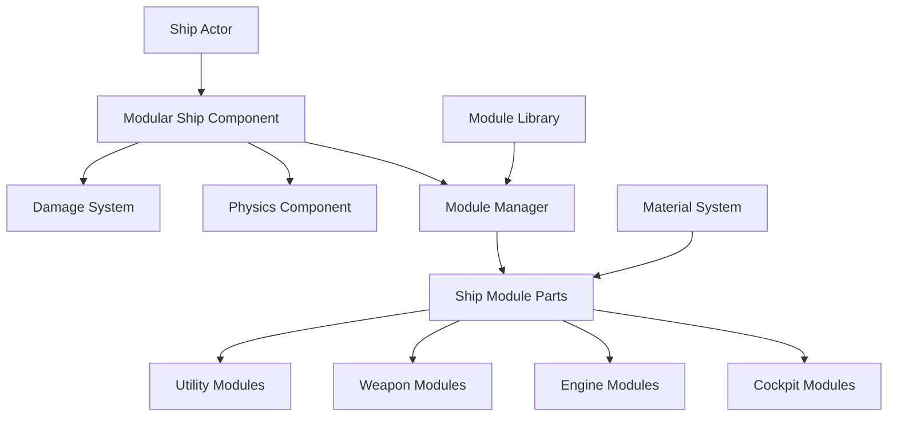

# Ship System Setup Guide

> **🎯 Goal:** Set up and configure the modular ship system in SubspaceUE  
> **⏱️ Time Required:** 1-2 hours  
> **📚 Prerequisites:** [Complete Setup Guide](COMPLETE_SETUP_GUIDE.md) completed

---

## 📋 Table of Contents

1. [Overview](#overview)
2. [Prerequisites](#prerequisites)
3. [Ship System Architecture](#ship-system-architecture)
4. [Setting Up Ship Modules](#setting-up-ship-modules)
5. [Creating Your First Ship](#creating-your-first-ship)
6. [Testing and Verification](#testing-and-verification)
7. [Advanced Configuration](#advanced-configuration)
8. [Troubleshooting](#troubleshooting)

---

## 🎯 Overview

The SubspaceUE ship system uses a **modular approach** where ships are built from pre-defined parts (cockpits, engines, wings, weapons, etc.) rather than individual voxels. This guide will help you:

- ✅ Understand the ship module system
- ✅ Set up required assets and blueprints
- ✅ Configure ship module definitions
- ✅ Create custom ship designs
- ✅ Test ship functionality

### What You'll Build

By the end of this guide, you'll have:
- 🚀 Functional modular ship system
- 🛠️ Library of ship modules (17+ types)
- 🎨 Ability to create custom ships
- ⚡ Working ship physics and controls

---

## 📦 Prerequisites

### Required Knowledge
- ✅ Basic Unreal Engine navigation
- ✅ Understanding of Blueprints
- ✅ Familiarity with UE5 Content Browser

### Required Software
- ✅ SubspaceUE project set up (see [Complete Setup Guide](COMPLETE_SETUP_GUIDE.md))
- ✅ Unreal Engine 5.7 running
- ✅ Visual Studio 2022 (for C++ modules)

### Required Assets
- ✅ Ship module meshes (from project or Marketplace)
- ✅ Material library for ships
- ✅ Textures and normal maps

---

## 🏗️ Ship System Architecture

### System Overview



### Key Components

#### 1. **ModularShipComponent**
- Main component managing the ship
- Handles module attachment and detachment
- Manages ship stats and health

#### 2. **ShipModulePart**
- Individual module instance
- Contains position, rotation, health
- Links to module definition

#### 3. **ShipModuleDefinition**
- Module type definition
- Defines attachment points
- Specifies stats and requirements

#### 4. **ModuleLibrary**
- Registry of all available modules
- 17 built-in module types
- Extensible for custom modules

---

## 🛠️ Setting Up Ship Modules

### Step 1: Create Module Asset Folder

1. Open Content Browser
2. Navigate to `/Game/Ships/`
3. Create folder structure:
   ```
   /Game/Ships/
   ├── Modules/
   │   ├── Cockpits/
   │   ├── Engines/
   │   ├── Wings/
   │   ├── Weapons/
   │   └── Utility/
   ├── Materials/
   ├── Textures/
   └── Blueprints/
   ```

### Step 2: Import Ship Module Meshes

#### Using Marketplace Assets

1. **Go to Unreal Marketplace**
   - Open Epic Games Launcher
   - Go to Marketplace tab
   - Search for "modular spaceship" or "sci-fi ship parts"
   - Recommended: "Star Sparrow Modular Spaceship" or similar

2. **Add to Project**
   - Click "Add to Project"
   - Select SubspaceUE
   - Wait for download

3. **Locate Assets**
   - In UE5 Content Browser
   - Navigate to plugin content folder
   - Copy meshes to `/Game/Ships/Modules/`

#### Using Custom Meshes

If you have custom 3D models:

1. **Prepare Models** (in Blender/Maya)
   - Export as FBX
   - Scale: 1 unit = 1 cm (UE5 standard)
   - Pivot point at attachment point
   - Collision meshes included

2. **Import to UE5**
   - Content Browser → Import
   - Select FBX files
   - Import settings:
     - ✅ Skeletal Mesh: No (unless animated)
     - ✅ Import Materials: Yes
     - ✅ Import Textures: Yes
     - ✅ Generate Lightmap UVs: Yes
     - ✅ Auto Generate Collision: Yes

3. **Organize**
   - Move to appropriate module folder
   - Rename for clarity (e.g., `SM_Cockpit_Small_01`)

### Step 3: Create Module Definitions

Module definitions tell the system what each module is and how it behaves.

#### Create Module Definition Asset

1. **Create Blueprint**
   - Right-click in `/Game/Ships/Blueprints/`
   - Blueprint Class → Object
   - Search and select: `ShipModuleDefinition`
   - Name: `SMD_Cockpit_Basic`

2. **Configure Module Properties**
   
   Open the blueprint and set:

   **Basic Info:**
   - Module Name: `Basic Cockpit`
   - Module Type: `Hull - Cockpit`
   - Module Category: `Hull`
   - Module Size: `Small` (2x2x2 units)

   **Stats:**
   - Health: `100`
   - Mass: `50` kg
   - Power Consumption: `5` units
   - Crew Required: `1`

   **Visuals:**
   - Static Mesh: Select your cockpit mesh
   - Material: Select ship material

   **Attachment Points:**
   ```
   Attachment Points (Array):
   [0] Position: (0, 100, 0)  - Front connection
   [1] Position: (0, -100, 0) - Rear connection
   [2] Position: (50, 0, 0)   - Right connection
   [3] Position: (-50, 0, 0)  - Left connection
   ```

3. **Save** (Ctrl+S)

#### Create Multiple Module Definitions

Repeat for each module type:

**Cockpits:**
- `SMD_Cockpit_Basic` - Basic command pod
- `SMD_Cockpit_Advanced` - Advanced bridge
- `SMD_Cockpit_Fighter` - Single-seat fighter

**Engines:**
- `SMD_Engine_Small` - Basic thruster
- `SMD_Engine_Large` - Main engine
- `SMD_Engine_Boost` - Afterburner

**Weapons:**
- `SMD_Weapon_LaserSmall` - Light laser
- `SMD_Weapon_LaserHeavy` - Heavy laser
- `SMD_Weapon_Missile` - Missile launcher

---

### Step 4: Register Modules in Module Library

1. **Open Module Library**
   - Content Browser → `/Game/Systems/`
   - Open `BP_ModuleLibrary`

2. **Add Module Entries**
   
   In the Module Registry array, add entries:
   ```
   Module Registry (Array):
   [0] Module ID: "cockpit_basic"
       Module Definition: SMD_Cockpit_Basic
       Unlock Level: 1
       Cost: 1000

   [1] Module ID: "engine_small"
       Module Definition: SMD_Engine_Small
       Unlock Level: 1
       Cost: 500

   [2] Module ID: "weapon_laser_small"
       Module Definition: SMD_Weapon_LaserSmall
       Unlock Level: 2
       Cost: 750
   ```

3. **Save**

---

## 🚀 Creating Your First Ship

### Method 1: Using Ship Builder UI (Recommended for Beginners)

1. **Open Ship Builder**
   - Play in Editor (PIE)
   - Press `B` key to open Ship Builder
   
2. **Place Cockpit**
   - Select "Cockpits" category
   - Click "Basic Cockpit"
   - Click in center of grid to place

3. **Add Engine**
   - Select "Engines" category
   - Click "Small Engine"
   - Click behind cockpit to attach

4. **Add Weapons**
   - Select "Weapons" category
   - Click "Small Laser"
   - Click on front attachment points

5. **Test Ship**
   - Click "Preview" to see 3D view
   - Click "Save" to save design
   - Click "Launch" to spawn and control

### Method 2: Procedural Ship Generation (Advanced)

Use the procedural generator to create random ships:

1. **Open Ship Generator**
   - Content Browser → `/Game/Systems/`
   - Open `BP_ProceduralShipGenerator`

2. **Configure Generator**
   
   Set parameters:
   ```
   Ship Size: Medium
   Ship Class: Fighter
   Complexity: 5 (more modules)
   Symmetry: True
   Material Tier: Iron
   ```

3. **Generate Ships**
   - Click "Generate Ship"
   - Preview generated ships
   - Click "Accept" to use
   - Click "Regenerate" for different design

4. **Save Design**
   - Click "Save as Blueprint"
   - Name: `BP_GeneratedFighter_01`

### Method 3: Manual Blueprint Creation (For Developers)

Create a ship entirely in blueprints:

1. **Create Ship Blueprint**
   - Right-click in Content Browser
   - Blueprint Class → Actor
   - Search: `ModularShipActor`
   - Name: `BP_CustomShip`

2. **Add Components**
   
   In the blueprint viewport:
   - Add `ModularShipComponent`
   - Add `PhysicsComponent`
   - Add `ShipControllerComponent`

3. **Configure in Construction Script**

   ```blueprint
   Construction Script:
   ├─ Add Module (Cockpit)
   │   Position: (0, 0, 0)
   │   Module: SMD_Cockpit_Basic
   │
   ├─ Add Module (Engine)
   │   Position: (0, -200, 0)
   │   Module: SMD_Engine_Small
   │
   ├─ Add Module (Weapon Left)
   │   Position: (-100, 50, 0)
   │   Module: SMD_Weapon_LaserSmall
   │
   └─ Add Module (Weapon Right)
       Position: (100, 50, 0)
       Module: SMD_Weapon_LaserSmall
   ```

4. **Compile and Save**

---

## ✅ Testing and Verification

### Test Checklist

Run through these tests to verify your ship system:

#### Basic Tests

- [ ] **Module Placement** - Can place modules in builder
- [ ] **Module Attachment** - Modules attach to correct points
- [ ] **Module Visuals** - Modules display correctly
- [ ] **Module Stats** - Stats shown accurately

#### Functional Tests

- [ ] **Ship Spawning** - Ship spawns in level
- [ ] **Physics** - Ship obeys physics correctly
- [ ] **Controls** - Can control ship movement
- [ ] **Module Health** - Modules take damage properly

#### Advanced Tests

- [ ] **Module Detachment** - Damaged modules detach
- [ ] **Power System** - Power distributes correctly
- [ ] **Weapons** - Weapons fire properly
- [ ] **Save/Load** - Ship designs save and load

### Running Tests

1. **Open Test Level**
   - Content Browser → `/Game/Maps/`
   - Open `TestShip` level

2. **Place Test Ship**
   - Drag `BP_CustomShip` into level
   - Position at origin (0, 0, 100)

3. **Play in Editor**
   - Click Play
   - Use WASD to move
   - Use Mouse to look
   - Press Space to fire weapons

4. **Verify Results**
   - Check Output Log for errors
   - Verify ship moves correctly
   - Test damage system (shoot at it from another ship)

### Debug Visualization

Enable debug visuals to see ship internals:

1. **Console Commands** (press ` during play):
   ```
   ShowDebug.Ship
   ShowDebug.Modules
   ShowDebug.AttachmentPoints
   ShowDebug.Physics
   ```

2. **Visual Indicators:**
   - Green boxes = Healthy modules
   - Yellow boxes = Damaged modules
   - Red boxes = Destroyed modules
   - Blue lines = Attachment points
   - Purple spheres = Center of mass

---

## ⚙️ Advanced Configuration

### Custom Module Types

Create entirely new module types:

1. **Create Module Definition**
   - New blueprint from `ShipModuleDefinition`
   - Name: `SMD_Shield_Generator`

2. **Add Custom Behavior**
   
   In Event Graph:
   ```blueprint
   Event Tick:
   ├─ Get Ship Component
   ├─ Check Power Available
   ├─ If Power > 0:
   │   ├─ Regenerate Shield
   │   └─ Consume Power
   └─ Update Shield Visual Effect
   ```

3. **Register in Library**
   - Add to Module Library
   - Set category: `Utility`

### Material Tiers

Configure different material tiers (Iron, Titanium, etc.):

1. **Open Material Config**
   - `/Game/Systems/Data/MaterialTiers`

2. **Configure Tier Properties**
   ```
   Iron Tier:
     - Health Multiplier: 1.0
     - Mass Multiplier: 1.0
     - Cost Multiplier: 1.0
     - Color: Gray

   Titanium Tier:
     - Health Multiplier: 1.5
     - Mass Multiplier: 0.9
     - Cost Multiplier: 2.0
     - Color: Silver
   ```

### Physics Tuning

Adjust ship physics feel:

1. **Open Ship Physics Config**
   - Select ship actor
   - Details panel → Physics Component

2. **Adjust Parameters**
   ```
   Linear Damping: 0.5  (air resistance)
   Angular Damping: 2.0  (rotation resistance)
   Mass: 1000 kg
   Max Linear Velocity: 5000 cm/s
   Max Angular Velocity: 180 deg/s
   ```

---

## 🔧 Troubleshooting

### Modules Not Appearing

**Symptoms:** Modules don't show in builder

**Solutions:**
1. Verify module definitions are saved
2. Check Module Library has entries
3. Ensure meshes are assigned to definitions
4. Check Output Log for errors

### Modules Not Attaching

**Symptoms:** Can't attach modules together

**Solutions:**
1. Verify attachment points are defined
2. Check attachment point positions are correct
3. Ensure module sizes are compatible
4. Check for overlapping modules

### Ship Falls Through World

**Symptoms:** Ship spawns and falls indefinitely

**Solutions:**
1. Enable physics on ship component
2. Check collision is enabled on modules
3. Verify spawn location is above ground
4. Add Player Start with correct height

### Ship Won't Move

**Symptoms:** Controls don't work

**Solutions:**
1. Verify ShipControllerComponent is attached
2. Check input bindings are set up
3. Ensure ship has engine modules
4. Check power system is active

### Performance Issues

**Symptoms:** Low FPS with ships in scene

**Solutions:**
1. Reduce module complexity (lower poly meshes)
2. Use LODs for distant ships
3. Enable instancing for repeated modules
4. Reduce number of active ships

---

## 📚 Related Documentation

- [Modular Ship System Guide](guides/MODULAR_SHIP_SYSTEM_GUIDE.md) - Complete system documentation
- [Ship Interior Generation](SHIP_INTERIOR_GENERATION_GUIDE.md) - Adding interiors
- [Building Guide](guides/BUILDING_GUIDE.md) - Construction mechanics
- [Physics System Setup](PHYSICS_SYSTEM_SETUP.md) - Physics configuration

---

## 🎓 Next Steps

After setting up the ship system:

1. **Create Custom Ships** - Design your own ship types
2. **Set Up AI Ships** - [AI System Setup](AI_SYSTEM_SETUP.md)
3. **Add Ship Weapons** - [Combat System Setup](COMBAT_SYSTEM_SETUP.md)
4. **Build Space Station** - Use ship modules for stations too

---

**🎉 Your ship system is ready! Time to build amazing spaceships! 🚀**

---

**Navigation:**  
[← Back: Complete Setup](COMPLETE_SETUP_GUIDE.md) | [🏠 Home](README.md) | [Next: Space Scene Setup →](SPACE_SCENE_SETUP.md)
