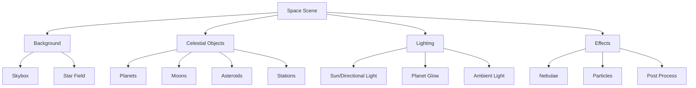

# Space Scene Setup Guide

> **🎯 Goal:** Create beautiful, professional space environments in SubspaceUE  
> **⏱️ Time Required:** 2-3 hours  
> **📚 Prerequisites:** [Complete Setup Guide](COMPLETE_SETUP_GUIDE.md) completed

---

## 📋 Table of Contents

1. [Overview](#overview)
2. [Prerequisites](#prerequisites)
3. [Space Environment Basics](#space-environment-basics)
4. [Creating Your First Space Scene](#creating-your-first-space-scene)
5. [Adding Celestial Objects](#adding-celestial-objects)
6. [Lighting and Atmosphere](#lighting-and-atmosphere)
7. [Visual Effects](#visual-effects)
8. [Performance Optimization](#performance-optimization)
9. [Troubleshooting](#troubleshooting)

---

## 🎯 Overview

Learn to create stunning space environments with:
- 🌌 Skyboxes and star fields
- 🪐 Planets and celestial bodies
- ☀️ Suns and lighting
- ☁️ Nebulae and gas clouds
- ✨ Particle effects
- 🎨 Post-processing effects

### What You'll Create

By the end of this guide:
- 🌟 Realistic space skybox
- 🪐 Multiple planets with atmospheres
- ☀️ Dynamic sun lighting
- ☁️ Volumetric nebulae
- ✨ Ambient particle effects

---

## 📦 Prerequisites

### Required Assets

Download these from Unreal Marketplace (free):

1. **Skyboxes:**
   - "Space Skyboxes Vol 1" or similar
   - Or use procedural skybox system

2. **Planet Textures:**
   - "Planet Textures Pack"
   - High-res planet diffuse and normal maps

3. **VFX:**
   - "Niagara Space VFX"
   - Particle effects for space

### Required Knowledge
- ✅ Basic level creation in UE5
- ✅ Understanding of lighting
- ✅ Material basics

---

## 🌌 Space Environment Basics

### Understanding Space in UE5

Space scenes require special considerations:

**Key Differences from Ground Scenes:**
- No horizon - 360° sky visible
- No atmospheric scattering
- Distant objects (planets) at extreme scale
- Lighting is stark (no atmosphere)
- Need star background

### Space Scene Components



---

## 🚀 Creating Your First Space Scene

### Step 1: Create Base Level

1. **New Level**
   - File → New Level
   - Select **Empty Level**
   - Click Create

2. **Save Level**
   - File → Save Current Level As...
   - Name: `SpaceScene_Main`
   - Location: `/Game/Maps/Space/`

### Step 2: Add Skybox

#### Method 1: Using Skybox Asset

1. **Import Skybox Texture**
   - Content Browser → Import
   - Select skybox cubemap or HDR image
   - Import settings:
     - Texture Group: `Skybox`
     - Compression: `TC_HDR`
     - Never Stream: `True`

2. **Create Skybox Material**
   - Right-click → Material
   - Name: `M_SpaceSkybox`
   - Open material editor

3. **Material Setup**
   ```
   Material Properties:
     - Material Domain: Surface
     - Blend Mode: Opaque
     - Shading Model: Unlit
     - Fully Rough: True

   Material Graph:
     TextureSampleCube (Skybox Texture)
     ↓
     Multiply (by brightness value, default 1.5)
     ↓
     Emissive Color
   ```

4. **Apply to Sky Sphere**
   - Place Actors → Sky Sphere
   - Details → Sky Sphere → Sky Material: `M_SpaceSkybox`
   - Details → Scale: (1000, 1000, 1000)

#### Method 2: Procedural Star Field

1. **Create Star Field Material**
   - New Material: `M_ProceduralStarField`
   
2. **Material Graph**
   ```
   Absolute World Position
   ↓
   Divide by 10000 (scale)
   ↓
   VoronoiNoise (Cell: 3x3x3, Jitter: 1.0)
   ↓
   Power (exponent: 50) - makes stars pinpoint
   ↓
   Multiply (by 100) - brightness
   ↓
   Emissive Color
   ```

3. **Place Sky Sphere**
   - Place Actors → Sky Sphere
   - Set material to `M_ProceduralStarField`

### Step 3: Set Up Lighting

1. **Add Directional Light (Sun)**
   - Place Actors → Directional Light
   - Name: `Sun`
   - Position: (0, 0, 500)
   - Rotation: (0, -45, 0) - sun angle

2. **Configure Sun Properties**
   ```
   Light Component:
     - Intensity: 10.0 lux
     - Light Color: (255, 245, 220) - warm white
     - Use Temperature: True
     - Temperature: 5500K
     - Atmosphere Sun Light: True
     - Cast Shadows: True
     - Dynamic Shadow Distance: 20000 cm
   ```

3. **Add Sky Light**
   - Place Actors → Sky Light
   - Name: `AmbientSpace`
   
4. **Configure Sky Light**
   ```
   Light Component:
     - Source Type: SLS Captured Scene
     - Intensity: 0.5
     - Color: (10, 10, 30) - deep blue ambient
     - Cast Shadows: False
   ```

5. **Add Exponential Height Fog** (Optional)
   - Place Actors → Exponential Height Fog
   - Fog Density: 0.0001 (very thin)
   - Fog Height Falloff: 0.01
   - Color: (0, 0, 10) - black with slight blue

### Step 4: Add Camera

1. **Place Camera**
   - Place Actors → Camera
   - Name: `MainCamera`
   - Position: (0, 0, 200)

2. **Configure Camera**
   ```
   Camera Component:
     - Field of View: 90.0
     - Aspect Ratio: 16:9
     - Near Clip Plane: 1.0
     - Far Clip Plane: 10000000.0 (very far for space)
   ```

3. **Set as Active**
   - Select camera
   - Right-click → Pilot Camera

### Step 5: Test Scene

1. **Build Lighting** (if using static lighting)
   - Build → Build Lighting Only
   - Quality: Production

2. **Play in Editor**
   - Click Play button
   - Look around with mouse
   - Should see star field/skybox

✅ **Success:** You see stars in all directions!

---

## 🪐 Adding Celestial Objects

### Creating a Planet

#### Step 1: Create Planet Mesh

1. **Add Sphere**
   - Place Actors → Sphere
   - Name: `Planet_Earth`
   - Position: (100000, 0, 0) - far from origin
   - Scale: (500, 500, 500) - large planet

2. **Set Up Collision**
   - Details → Collision
   - Collision Enabled: Query Only
   - Object Type: WorldStatic

#### Step 2: Create Planet Material

1. **Import Planet Textures**
   - Import: Earth diffuse texture (4096x2048)
   - Import: Earth normal map
   - Import: Earth specular/roughness map

2. **Create Material**
   - New Material: `M_Planet_Earth`
   - Material Domain: Surface
   - Blend Mode: Opaque
   - Shading Model: Default Lit

3. **Material Graph**
   ```
   TextureSample (Diffuse)
   ↓
   Base Color

   TextureSample (Normal)
   ↓
   Normal

   TextureSample (Specular) → R channel
   ↓
   Metallic

   TextureSample (Specular) → G channel
   ↓
   Roughness

   Constant (0.5) → Emissive (subtle glow on dark side)
   ```

4. **Apply Material**
   - Select Planet sphere
   - Details → Materials → Element 0: `M_Planet_Earth`

#### Step 3: Add Atmosphere Glow

1. **Create Atmosphere Material**
   - New Material: `M_Atmosphere_Glow`
   - Blend Mode: Translucent
   - Shading Model: Unlit

2. **Material Graph**
   ```
   Fresnel (Exponent: 3.0)
   ↓
   Multiply (by color: light blue)
   ↓
   Opacity and Emissive
   ```

3. **Add Atmosphere Sphere**
   - Place Sphere around planet
   - Scale: (505, 505, 505) - slightly larger
   - Material: `M_Atmosphere_Glow`
   - Translucency → Lighting Mode: Surface Translucency Volume

#### Step 4: Add Planet Rotation

1. **Select Planet**
   - Open Level Blueprint
   - Add Reference to Planet

2. **Add Rotation Logic**
   ```blueprint
   Event Tick
   ↓
   Get Planet Reference
   ↓
   Add Actor Local Rotation
     - Delta Rotation: (0, 0.02, 0) per frame
   ```

### Creating a Sun

1. **Add Sun Sphere**
   - Place Sphere: `Sun_Star`
   - Position: (0, 500000, 0) - very far
   - Scale: (1000, 1000, 1000) - huge

2. **Create Sun Material**
   - New Material: `M_Sun`
   - Shading Model: Unlit
   
3. **Sun Material Graph**
   ```
   Constant (10000) - very bright
   ↓
   Multiply (by orange color)
   ↓
   Emissive Color
   ```

4. **Add Point Light**
   - Add Point Light at sun location
   - Intensity: 1000000
   - Attenuation Radius: 1000000
   - Use Inverse Squared Falloff: True

### Creating Asteroids

1. **Import Asteroid Meshes**
   - Import various rock meshes
   - Or use UE5 starter content rocks

2. **Create Asteroid Material**
   - New Material: `M_Asteroid`
   - Use procedural noise for texture
   - Gray/brown color
   - High roughness

3. **Place Asteroids**
   ```blueprint
   For loop (100 iterations)
   ↓
   Random Location in Box
     - Box Extent: (50000, 50000, 10000)
   ↓
   Spawn Actor (Asteroid)
     - Random Scale (0.5 - 3.0)
     - Random Rotation
   ```

---

## 💡 Lighting and Atmosphere

### Volumetric Fog for Nebulae

1. **Add Volumetric Fog**
   - Place Actors → Exponential Height Fog
   - Name: `Nebula_Fog`

2. **Configure for Space**
   ```
   Fog Component:
     - Volumetric Fog: True
     - Volumetric Fog Scattering Distribution: 0.2
     - Volumetric Fog Albedo: (150, 50, 200) - purple
     - Volumetric Fog Extinction Scale: 0.1
   ```

3. **Add Fog Volumes**
   - Place multiple spheres with fog material
   - Various sizes and positions
   - Creates nebula effect

### HDR Bloom

1. **Add Post Process Volume**
   - Place Actors → Post Process Volume
   - Name: `PP_SpaceEffects`
   - Infinite Extent: True

2. **Configure Bloom**
   ```
   Bloom:
     - Intensity: 2.0
     - Threshold: 0.5
     - Size Scale: 4.0
     - Method: Standard
   ```

### Lens Flares

1. **Enable Lens Flares**
   - In Post Process Volume
   - Lens Flares → Intensity: 2.0
   - Lens Flares → Threshold: 0.5

2. **Configure Sun Flare**
   - Select Directional Light (Sun)
   - Light Shafts: True
   - Light Shaft Occlusion: True

---

## ✨ Visual Effects

### Ambient Space Particles

1. **Create Niagara System**
   - Content Browser → Right-click
   - FX → Niagara System
   - Template: Simple Sprite Burst
   - Name: `NS_AmbientSpaceDust`

2. **Configure Emitter**
   ```
   Emitter Properties:
     - Spawn Rate: 10 particles/sec
     - Lifetime: 30 seconds
     - Velocity: Very slow (1-5 units/sec)
     - Size: 1-5 units
     - Color: White with low opacity
     - Spawn Location: Large box around player
   ```

3. **Place in Level**
   - Drag Niagara System into level
   - Position: (0, 0, 0)
   - Auto-activate: True

### Star Twinkle Effect

1. **Modify Skybox Material**
   - Open `M_SpaceSkybox`
   - Add time-based noise to star brightness

2. **Material Graph Addition**
   ```
   Time (Sine Wave, Period: 2.0)
   ↓
   Multiply (by small value: 0.1)
   ↓
   Add to existing star brightness
   ```

---

## ⚡ Performance Optimization

### Level of Detail (LOD)

1. **Planet LODs**
   - Select planet mesh
   - LOD Settings → Number of LODs: 5
   - Auto-generate LODs
   - Screen Size thresholds: 0.5, 0.25, 0.1, 0.05

2. **Asteroid Culling**
   - Select asteroid instances
   - Rendering → Cull Distance: 100000

### Texture Streaming

1. **Enable Texture Streaming**
   - Project Settings → Engine → Rendering
   - Texture Streaming → Pool Size: 2000 MB

2. **Set Texture Priorities**
   - Planet textures: Priority 10 (highest)
   - Asteroid textures: Priority 1 (lowest)

### Shadow Optimization

1. **Dynamic Shadow Distance**
   - Directional Light → Dynamic Shadow Distance: 20000
   - Reduces distant shadow calculations

2. **Shadow Cascades**
   - Cascaded Shadow Maps → Num Cascades: 2
   - Fewer cascades = better performance

---

## 🔧 Troubleshooting

### Skybox Too Dark

**Solution:**
- Increase skybox material emissive multiplier
- Add Sky Light with higher intensity
- Check post-process exposure settings

### Planets Look Flat

**Solution:**
- Ensure normal maps are applied
- Add specular highlights
- Increase directional light intensity
- Add rim lighting (fresnel effect)

### Performance Issues

**Solution:**
- Reduce planet mesh resolution
- Use LODs aggressively
- Decrease particle counts
- Disable volumetric fog if not needed
- Lower post-process quality

---

## 📚 Related Documentation

- [Space Scene Generation](SPACE_SCENE_GENERATION_WITH_STORE_ASSETS.md) - Detailed guide
- [Skybox Material Guide](SKYBOX_MATERIAL_GUIDE.md) - Creating skyboxes
- [Camera & Visual Improvements](CAMERA_AND_VISUAL_IMPROVEMENTS.md) - Camera setup

---

**🌌 Your space scene is ready! Enjoy the cosmos! ✨**

---

**Navigation:**  
[← Back: Ship System Setup](SHIP_SYSTEM_SETUP.md) | [🏠 Home](README.md) | [Next: AI System Setup →](AI_SYSTEM_SETUP.md)
