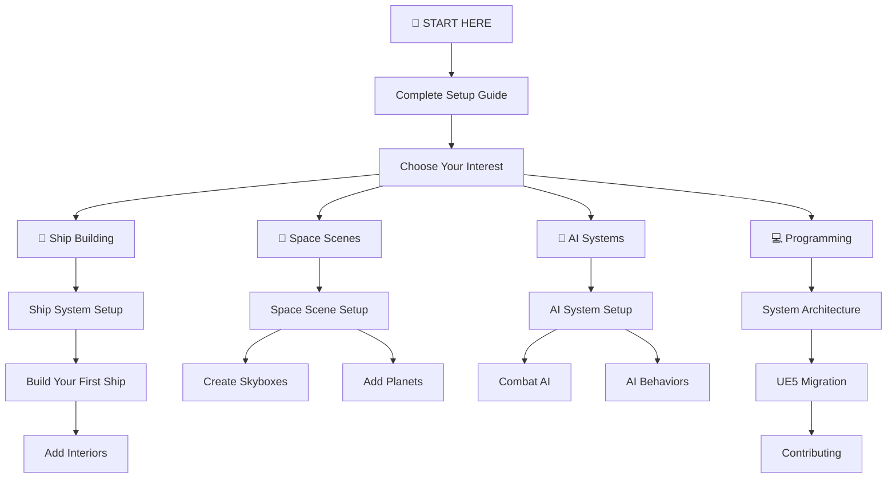
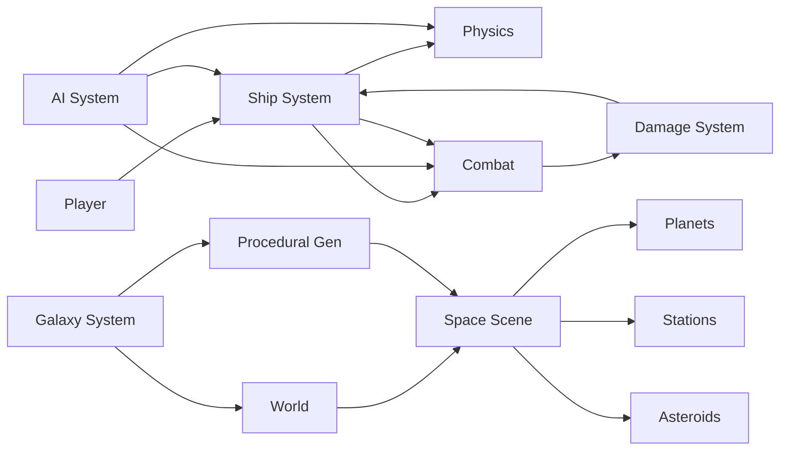
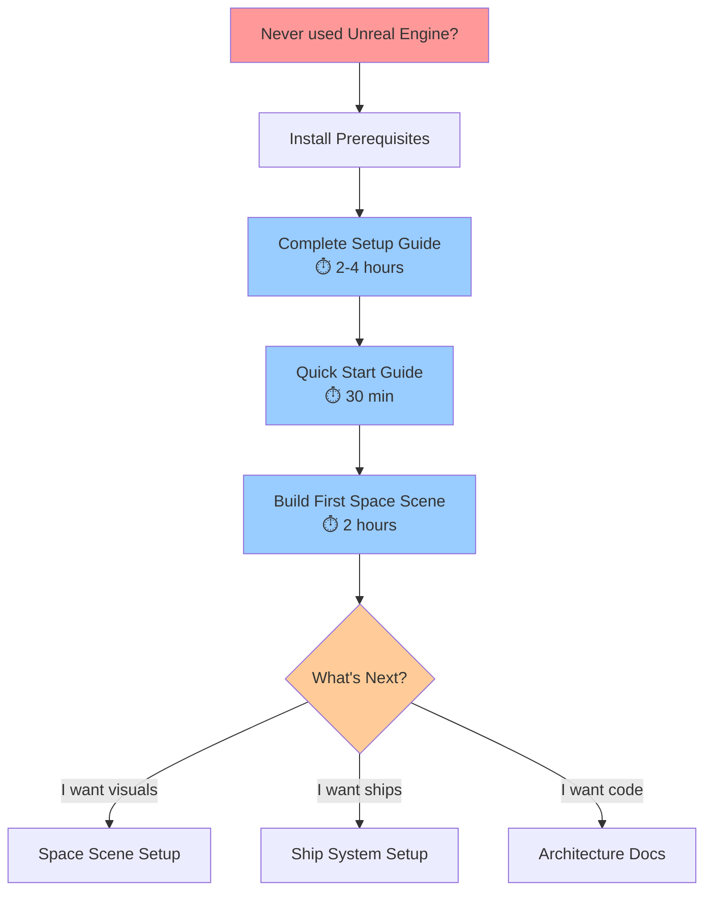
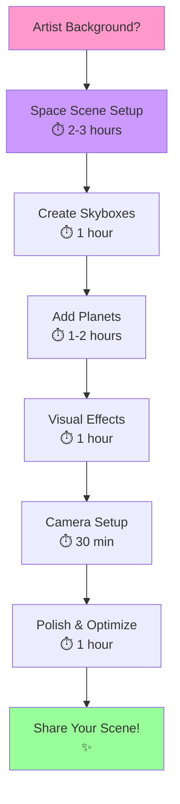
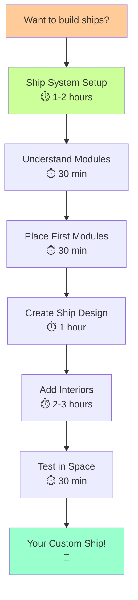
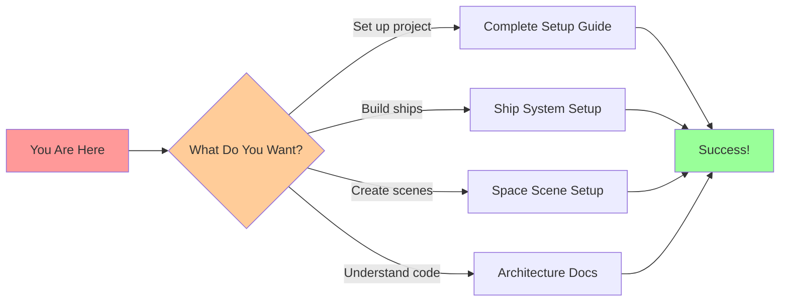

# Visual Learning Guide

> **🎯 Audience:** Visual learners who prefer diagrams, screenshots, and step-by-step visuals  
> **⏱️ Time Required:** Self-paced learning  
> **📚 Purpose:** Navigate documentation visually

---

## 🎨 Welcome Visual Learners!

This guide is designed specifically for people who learn best through **visuals, diagrams, and step-by-step images**. We understand that walls of text can be overwhelming, so we've organized the documentation with visual learners in mind.

---

## 🗺️ Visual Navigation Map

Here's how all the documentation connects:



---

## 📊 System Relationship Diagram

Understanding how systems work together:



---

## 🎯 Learning Path Flowcharts

### Path 1: Complete Beginner



### Path 2: Visual Artist



### Path 3: Ship Builder



---

## 🖼️ Documentation by Visual Type

### 📊 Guides with Lots of Diagrams

These guides have extensive Mermaid diagrams:

1. **[System Architecture](architecture/ARCHITECTURE.md)**
   - System flow diagrams
   - Component relationships
   - Data flow charts

2. **[AI System Setup](AI_SYSTEM_SETUP.md)**
   - Behavior tree diagrams
   - Decision flow charts
   - State machine diagrams

3. **[Ship System Setup](SHIP_SYSTEM_SETUP.md)**
   - Module attachment diagrams
   - Ship construction flow
   - Component hierarchy

### 🖼️ Guides with Screenshots (Coming Soon)

These will include step-by-step screenshots:

1. **Space Scene Creation** - Visual walkthrough
2. **Ship Builder UI** - Interface tutorial
3. **Material Editor** - Shader creation
4. **Blueprint Examples** - Visual scripting

### 🎥 Video Tutorial Placeholders

Video tutorials are planned for:

- [ ] **Complete Setup** - Full installation walkthrough
- [ ] **First Ship** - Building your first ship
- [ ] **Space Scene** - Creating a beautiful space environment
- [ ] **AI Setup** - Configuring AI ships

### 📸 Interactive Examples

Try these interactive examples (coming soon):

- **Ship Builder Simulator** - Interactive ship design
- **Material Editor** - Live material preview
- **AI Behavior Tester** - See AI in action

---

## 🎨 Visual Organization

### Color-Coded Categories

Our documentation uses visual markers:

- 🚀 **Setup & Installation** - Red/Orange
- 🎮 **Gameplay & Features** - Blue
- 🛠️ **Building & Creation** - Green
- 💻 **Programming & Code** - Purple
- 🎨 **Visual & Art** - Pink
- 🤖 **AI & Automation** - Yellow

### Icon Guide

Quick reference for icons used throughout docs:

| Icon | Meaning |
|------|---------|
| 🎯 | Goal or objective |
| ⏱️ | Time estimate |
| 📚 | Prerequisites needed |
| ✅ | Success indicator |
| ⚠️ | Warning or caution |
| 💡 | Tip or pro tip |
| 🔧 | Troubleshooting |
| 📊 | Diagram or chart |
| 🖼️ | Screenshot or image |
| 🎥 | Video content |
| 📄 | PDF available |
| 🔍 | Search or find |
| ⚡ | Performance tip |
| 🎨 | Visual/artistic |
| 💻 | Code or technical |

---

## 📸 Screenshot Locations

Find screenshots and diagrams here:

```
docs/images/
├── Capture.PNG          # Main interface
├── 1233.PNG             # Feature screenshot
├── 1234.PNG             # System overview
├── 12345.PNG            # Gameplay shot
└── 4456.PNG             # Visual example
```

**Using Images in Guides:**
```markdown

```

---

## 🗺️ Quick Reference Cards

### Setup Quick Reference

```
┌─────────────────────────────────┐
│     PREREQUISITES               │
├─────────────────────────────────┤
│ ✅ Epic Games Launcher          │
│ ✅ Unreal Engine 5.7            │
│ ✅ Visual Studio 2022           │
│ ✅ Git                          │
│ ⭕ .NET 9.0 SDK (optional)      │
└─────────────────────────────────┘
```

### System Requirements

```
┌─────────────────────────────────┐
│   MINIMUM        RECOMMENDED    │
├─────────────────────────────────┤
│   16 GB RAM      32 GB RAM      │
│   4 GB VRAM      8 GB VRAM      │
│   100 GB SSD     200 GB NVMe    │
│   Quad-core      8-core CPU     │
└─────────────────────────────────┘
```

### Time Estimates

```
┌─────────────────────────────────┐
│        TASK            TIME     │
├─────────────────────────────────┤
│ Complete Setup         2-4 hrs  │
│ First Space Scene      2-3 hrs  │
│ Build First Ship       1-2 hrs  │
│ AI System Setup        2-3 hrs  │
│ Read All Docs         10-15 hrs │
└─────────────────────────────────┘
```

---

## 🎓 Visual Learning Tips

### For Maximum Understanding:

1. **Follow Diagrams First**
   - Look at the flowcharts
   - Understand the big picture
   - Then read the details

2. **Use Interactive Website**
   - Better than static markdown
   - Search functionality
   - Click through links easily

3. **Take Screenshots**
   - Document your own progress
   - Compare with examples
   - Learn what works

4. **Draw Your Own Diagrams**
   - Sketch system relationships
   - Map out your project
   - Visual planning helps

5. **Watch for Updates**
   - Video tutorials coming soon
   - More screenshots being added
   - Interactive examples planned

---

## 📱 Documentation Formats Comparison

| Format | Visual Learners | Text Learners | Offline Use |
|--------|----------------|---------------|-------------|
| **Interactive Website** | ⭐⭐⭐⭐⭐ | ⭐⭐⭐⭐ | ⭐⭐ (cached) |
| **PDF Documents** | ⭐⭐⭐⭐ | ⭐⭐⭐⭐⭐ | ⭐⭐⭐⭐⭐ |
| **Markdown Files** | ⭐⭐ | ⭐⭐⭐⭐⭐ | ⭐⭐⭐⭐⭐ |
| **Video Tutorials** | ⭐⭐⭐⭐⭐ | ⭐⭐ | ⭐⭐⭐ (download) |

**Recommendation for Visual Learners:** Start with **Interactive Website**, supplement with **PDFs** for offline reading.

---

## 🎬 Next Steps

### Choose Your Path:



### Recommended Order:

1. 📖 **[Complete Setup Guide](COMPLETE_SETUP_GUIDE.md)** - Get everything installed
2. 🎨 **[Space Scene Setup](SPACE_SCENE_SETUP.md)** - Create beautiful space
3. 🚀 **[Ship System Setup](SHIP_SYSTEM_SETUP.md)** - Build your first ship
4. 🤖 **[AI System Setup](AI_SYSTEM_SETUP.md)** - Add AI ships
5. 🎮 **Start Creating!** - Make your own content

---

## 📚 Documentation Index

**Full List:** [Documentation Index](DOCUMENTATION_INDEX.md)

**Categories:**
- 📁 **architecture/** - System design (3 guides)
- 📁 **guides/** - How-to guides (73 guides)
- 📁 **implementation/** - Status docs (22 guides)
- 📁 **migration/** - UE5 migration (8 guides)
- 📁 **reference/** - Reference docs (9 guides)
- 📁 **research/** - Research docs (6 guides)

---

## 🎉 You've Got This!

Remember: **Everyone learns differently**. This documentation is designed to support YOUR learning style. Use the visuals, take your time, and don't hesitate to skip around to what interests you most!

---

**Happy Visual Learning! 🎨🚀**

---

**Navigation:**  
[🏠 Documentation Home](README.md) | [📋 Complete Index](DOCUMENTATION_INDEX.md) | [🚀 Start Setup →](COMPLETE_SETUP_GUIDE.md)
